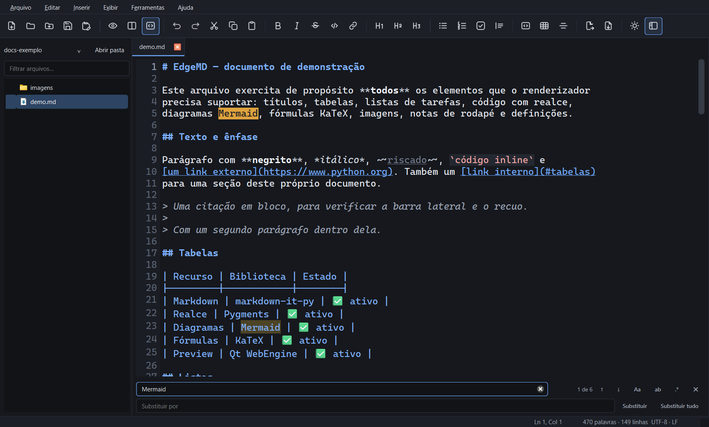
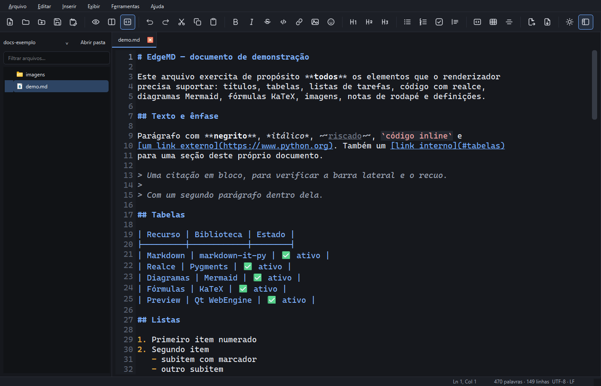

<div align="center">


# EdgeMD

**Leia Markdown como página, edite quando precisar.**

Leitor e editor de Markdown para Windows, Linux e macOS, com renderização por Chromium,
diagramas e fórmulas que funcionam offline, tema unificado em todo o
aplicativo e integração nativa com o Windows.

[](https://github.com/EduradoPessoa/edge-md/actions/workflows/tests.yml)
[](https://www.python.org/)
[](#gerar-o-executável)
[](LICENSE)

</div>

---

## Por que mais um leitor de Markdown

Porque a maioria obriga você a escolher entre duas coisas ruins: um
visualizador que não edita, ou um editor que abre com a tela cheia de código
quando você só queria ler.

O EdgeMD abre **lendo**. O documento ocupa a janela inteira, sem barra de
formatação nem painel de código. Quando você precisa mexer no texto, clica em
**Editar** — o botão azul no canto do documento — e a tela se divide: código à
esquerda, resultado à direita, atualizado enquanto você digita. **Concluir**
volta à leitura.

Também é um app do Windows de verdade, e não uma página num navegador:
instância única, ícone na bandeja e associação de arquivos.

## Recursos

<table>
<tr><td width="50%" valign="top">

**Leitura**

- Renderização por Chromium (Qt WebEngine)
- Tabelas, citações, notas de rodapé
- Listas de tarefas e de definição
- Realce de sintaxe com Pygments
- Botão de copiar em cada bloco de código
- Barra de progresso de leitura

</td><td width="50%" valign="top">

**Funciona sem internet**

- Diagramas [Mermaid](https://mermaid.js.org/) — fluxograma, sequência, classes
- Fórmulas [KaTeX](https://katex.org/) — em linha e em bloco
- Bibliotecas vendorizadas no repositório, não vindas de CDN

</td></tr>
<tr><td valign="top">

**Edição sob demanda**

- Abas, com marca de alteração não salva
- Numeração de linhas e realce de sintaxe
- `Enter` continua listas e citações
- Localizar e substituir, com destaque das ocorrências
- Inserção de link, imagem e emoji, com 376 emojis buscáveis
- Modelos para novos arquivos, editáveis como qualquer .md
- Gravação atômica: nunca deixa arquivo pela metade
- Preserva encoding (UTF-8/UTF-16/Windows-1252) e fim de linha

</td><td valign="top">

**Sistema e integração**

- Tema claro e escuro em **todo** o aplicativo
- Instância única: dez cliques duplos, uma janela
- Bandeja do sistema, com aviso de alterações pendentes
- Associação de `.md` nas três plataformas — sem administrador
- Exportação para HTML autônomo e PDF

</td></tr>
</table>

## Capturas

<div align="center">

**Modo de leitura** — o padrão ao abrir


**Modo de edição** — um clique em *Editar*


**Localizar e substituir** — com as ocorrências destacadas



**Seletor de emoji** — 376 emojis, com busca em português



**Tema claro**


</div>

## Instalação

Requer **Python 3.10 ou superior**. Funciona em Windows 10/11, Linux e macOS.

```bash
git clone https://github.com/EduradoPessoa/edge-md.git
cd edge-md

python -m pip install -r requirements.txt

# Bibliotecas de diagrama e fórmula (~4,7 MB, uma vez)
python tools/fetch_vendor.py

# Ícones a partir da arte de origem
python tools/make_icons.py

python -m edgemd
```

No Windows, use `pythonw run.pyw` em vez de `python -m edgemd`: o `pythonw` não
abre janela de console junto.

> **Atenção ao Qt WebEngine.** A versão do `PyQt6-WebEngine` precisa acompanhar
> a linha do `PyQt6`. O `requirements.txt` já fixa `PyQt6-WebEngine==6.10.0`
> para casar com o Qt 6.10; misturar 6.10 com 6.11 faz o Chromium não subir,
> com erro de contexto OpenGL.

## Uso

### Abrir arquivos

| Como | O quê |
|---|---|
| `Ctrl+O` | Abrir um ou vários arquivos |
| `Ctrl+Shift+O` | Abrir uma pasta na barra lateral |
| Arrastar e soltar | Solte arquivos para abrir, ou uma pasta para navegar |
| Clique duplo no `.md` | Só depois de associar (abaixo) |

### Associar arquivos `.md` ao EdgeMD

Pelo próprio programa: **Ferramentas → Associar arquivos .md a este app**.

Ou por linha de comando:

```powershell
# Adiciona a "Abrir com", sem mexer no seu programa padrão atual
.\installer\register_file_association.ps1

# Torna o EdgeMD o padrão do clique duplo
.\installer\register_file_association.ps1 -Default

# Desfaz tudo
.\installer\unregister_file_association.ps1
```

Nada disso exige administrador: tudo vai para `HKEY_CURRENT_USER`. O
desinstalador é conservador — se você tiver trocado o programa padrão depois, a
sua escolha é preservada.

### Atalhos

| Atalho | Ação | Atalho | Ação |
|---|---|---|---|
| `Ctrl+N` | Novo arquivo (usa o modelo padrão) | `Ctrl+B` | Negrito |
| `Ctrl+Shift+N` | Novo a partir de modelo | `Ctrl+I` | Itálico |
| `Ctrl+O` | Abrir | `Ctrl+I` | Itálico |
| `Ctrl+S` | Salvar | `Ctrl+K` | Link |
| `Ctrl+W` | Fechar aba | `Ctrl+1` `Ctrl+2` `Ctrl+3` | Títulos 1 a 3 |
| `Ctrl+Shift+P` | Somente leitura | `Ctrl+Shift+C` | Bloco de código |
| `Ctrl+Shift+D` | Editar (lado a lado) | `Ctrl+Shift+T` | Tabela |
| `Ctrl+Shift+M` | Somente editor | `Ctrl+Shift+9` | Item de tarefa |
| `Ctrl+T` | Alternar tema | `Ctrl+E` | Exportar HTML |
| `Ctrl+L` | Barra lateral | `Ctrl+Shift+E` | Exportar PDF |
| `Ctrl+F` | Localizar (na edição) | `F3` / `Shift+F3` | Próxima / anterior |
| `Ctrl+H` | Localizar e substituir | `Esc` | Fechar a busca |
| `Ctrl+K` | Inserir link | `Ctrl+Shift+I` | Inserir imagem |
| `Ctrl+.` | Inserir emoji | `F5` | Redesenhar o preview |
| Duplo clique no documento | Entrar na edição | | |

Fechar a janela (**X**) não encerra o app: ele continua na bandeja. Para sair de
verdade, use **Arquivo → Sair** ou o menu do ícone na bandeja.

## Inserir link, imagem e emoji

Os três botões ficam na barra de ferramentas, junto da formatação — e só fazem
sentido na edição.

**Link** (`Ctrl+K`) abre um diálogo com texto e endereço, em vez de escrever
`[texto](url)` e deixar a palavra "url" selecionada para você digitar por cima.
Com uma palavra selecionada no documento, ela vem como texto do link; se houver
um endereço no clipboard, ele vem como endereço.

**Imagem** (`Ctrl+Shift+I`) abre o seletor de arquivo e cuida do caminho, que é
a parte que costuma dar errado:

| A imagem está | O que acontece |
|---|---|
| Na pasta do documento | Caminho relativo, nada é copiado |
| Fora dela | Oferece copiar para `imagens/` ao lado do `.md` |
| Documento ainda não salvo | Avisa que o caminho ficou absoluto |

Copiar é o padrão porque um caminho `C:\Users\...` funciona só na máquina de
quem escreveu. Inserir a mesma imagem duas vezes reaproveita a cópia em vez de
encher a pasta de `foto-2.png`, `foto-3.png`.

**Emoji** (`Ctrl+.`) abre um seletor ancorado no botão, com 376 emojis em sete
categorias. A busca é em português e ignora acento — "coracao" acha ❤️, "bug"
acha 🐞 — e apelidos no estilo do GitHub funcionam: `:tada:`, `:rocket:`,
`:warning:`. `Enter` insere o primeiro resultado. Depois de inserir, o emoji cai
com um espaço antes se estiver colado numa palavra.

## Modelos para novos arquivos

O `Ctrl+N` cria um documento em branco, ou o modelo que você definir como
padrão. `Ctrl+Shift+N` pergunta qual usar.

**Salvar como modelo** (menu Ferramentas) guarda o documento aberto como
modelo. Os modelos ficam em **Ferramentas → Abrir pasta de modelos** — são
arquivos `.md` comuns, e o melhor editor para eles é o próprio EdgeMD: abra,
ajuste e salve, com realce e pré-visualização.

O app traz cinco modelos prontos: nota de reunião, documentação de projeto,
artigo, diário e apresentação de ideia. Eles não podem ser alterados; salvar
por cima cria uma cópia sua com prioridade na lista.

Os modelos aceitam marcadores que são substituídos na criação:

| Marcador | Vira |
|---|---|
| `{data}` | 19/09/2026 |
| `{hora}` | 14:32 |
| `{data_iso}` | 2026-09-19 |
| `{data_hora}` | 19/09/2026 14:32 |
| `{assunto}` / `{titulo}` | o nome que você digitar no diálogo |

Depois de criar, o cursor já fica na primeira linha em branco do modelo — pronto
para escrever, sem precisar caçar o lugar.

## Localizar e substituir

Disponível **só na edição** — no modo de leitura não há o que procurar nem
trocar, então as ações ficam desabilitadas em vez de abrir uma barra que não
pode operar sobre nada. Ao voltar para a leitura, a barra se fecha sozinha: um
campo ativo sobre um editor escondido seria um comando às cegas.

- `Ctrl+F` abre com o campo de busca; `Ctrl+H` já traz o de substituição.
- Com uma palavra selecionada no editor, ela vem como termo inicial.
- `Enter` vai para a próxima ocorrência, `Shift+Enter` para a anterior.
- `F3` e `Shift+F3` funcionam mesmo com a barra fechada — abrem e navegam.
- O contador mostra "3 de 17", e o campo fica com contorno vermelho quando não
  há resultado.
- Todas as ocorrências ficam destacadas em âmbar; a atual, mais forte.
- "Substituir" troca a ocorrência em foco e avança; "Substituir tudo" troca de
  uma vez e entra no histórico como **um único** `Ctrl+Z`.

Opções na própria barra: **Aa** diferencia maiúsculas, **ab** exige palavra
inteira, **.*** trata o termo como expressão regular. Em modo regex, o campo de
substituição aceita `\1`..`\9` para referenciar grupos capturados.

## Exportação

**HTML** gera um arquivo que funciona em qualquer máquina: as imagens locais são
embutidas como `data:` URI e Mermaid/KaTeX passam a vir de CDN, já que os
arquivos locais não viajam junto. O resultado é autocontido.

**PDF** usa a impressão do Chromium, em A4. A geração espera os diagramas e as
fórmulas terminarem de desenhar — sem isso, sairiam em branco.

## Gerar o executável

O PyInstaller **não compila para outra plataforma**: cada sistema empacota o
próprio interpretador e as próprias bibliotecas nativas. O caminho mais simples
é o workflow de release, que roda a matriz nas três e anexa os artefatos a um
GitHub Release ao publicar uma tag.

### Localmente

```bash
python -m pip install -r requirements.txt pyinstaller
python tools/fetch_vendor.py       # no Windows: python tools\fetch_vendor.py
python tools/make_icons.py           # no Windows: python tools\make_icons.py

python packaging/build.py                  # só o bundle
python packaging/build.py --instalador     # bundle + instalador do sistema
```

O resultado vai para `dist/`:

| Sistema | Bundle | Instalador |
|---|---|---|
| Windows | `dist/edgemd/` | `dist/installer/EdgeMD-0.1.0-setup.exe` (Inno Setup) |
| Linux | `dist/edgemd/` | `dist/linux/edgemd_0.1.0_amd64.deb` e `EdgeMD-0.1.0-x86_64.AppImage` |
| macOS | `dist/EdgeMD.app` | `dist/macos/EdgeMD-0.1.0.dmg` |

O instalador do Windows precisa do [Inno Setup](https://jrsoftware.org/isdl.php)
no PATH; o do Linux, do `dpkg-deb` (vem com o Debian/Ubuntu) e, para o AppImage,
do `appimagetool` — que o script baixa sozinho quando não encontra.

### Pelo GitHub Actions

Publique uma tag e a matriz compila nas três plataformas:

```bash
git tag v0.1.0
git push origin v0.1.0
```

O Release é criado como **rascunho**, para você revisar antes de publicar.

Sobre as assinaturas: o DMG é assinado ad-hoc (roda em quem compilou, mas o
Gatekeeper avisa em outra máquina) e o `.exe` não é assinado. Distribuir para
terceiros sem esses avisos exige certificado de desenvolvedor Apple e
certificado de code signing da Microsoft.

## Privacidade e associação de arquivos por sistema

A associação é o que faz o clique duplo num `.md` abrir aqui, e cada sistema
resolve isso de um jeito bem diferente. O app detecta onde está rodando e faz a
coisa certa — o diálogo de **Ferramentas → Associar arquivos** explica o caso da
sua plataforma.

| | Como funciona | Onde fica |
|---|---|---|
| **Windows** | Registro, em três camadas: ProgID, `OpenWithProgids` e `Capabilities` | `HKEY_CURRENT_USER` — sem administrador |
| **Linux** | Arquivo `.desktop` com `MimeType=` + ícones hicolor + `xdg-mime` | `~/.local/share` e `~/.config/mimeapps.list` |
| **macOS** | `Info.plist` do bundle, lido pelo LaunchServices | dentro do `EdgeMD.app` |

Nada é instalado em nível de sistema e nenhum dos três pede senha de
administrador. Desfazer também é possível: `Ferramentas → Desfazer associação`,
ou os scripts em `installer/` no Windows.

O único que funciona de forma diferente: no macOS a associação **nasce no
empacotamento**, não em tempo de execução — é o `Info.plist` que declara os
tipos de documento. Por isso, rodando do código-fonte, o macOS não oferece o
app; é preciso ter o `EdgeMD.app`. Para defini-lo como padrão por linha de
comando, o app usa o [`duti`](https://github.com/jhbadger/duti) quando ele está
instalado, e orienta pelo Finder quando não está.

## Como foi feito

```
run.pyw                     entrada sem console
src/edgemd/
  app.py                    inicialização, argumentos, instância única
  window.py                 janela principal: abas, menus, barra de ferramentas
  editor_tab.py             um documento: caminho, encoding, gravação atômica
  editor_widget.py          editor com numeração de linhas
  md_highlighter.py         realce de sintaxe Markdown
  preview.py                QWebEngineView e a ponte com o JavaScript
  mode_bar.py               faixa com o nome do arquivo e Editar/Concluir
  sidebar.py                árvore de arquivos
  tray.py                   ícone na bandeja
  find_bar.py               barra de localizar e substituir
  search.py                 lógica de busca (sem interface)
  search_controller.py      liga a barra ao texto do editor
  insert_dialogs.py         diálogos de link e de imagem
  image_insert.py           caminho relativo e cópia da imagem
  emojis.py                 catálogo de emojis com busca
  emoji_picker.py           seletor de emoji em popup
  templates.py              modelos para novos documentos
  template_picker.py        escolha de modelo, com prévia
  theme.py                  paleta única: gera o CSS do preview e o QSS do Qt
  icon_shapes.py            desenho dos ícones das ações, em SVG
  icons.py                  arte do produto e ícones de ação
  config.py                 preferências (QSettings)
  single_instance.py        canal de instância única (named pipe)
  shell.py                  Lixeira, revelar arquivo e abrir com o padrão
  association/              associação de arquivos por plataforma
    common.py               tipos e comandos compartilhados
    windows.py              registro (HKCU)
    linux.py                .desktop, ícones hicolor e xdg-mime
    macos.py                Info.plist do bundle e duti
  export.py                 exportação para HTML e PDF
  safety.py                 rede de segurança contra falhas na interface
  render/
    plugins.py              parser markdown-it-py e extensões
    renderer.py             Markdown -> documento HTML
    assets/                 CSS dos temas, JS do preview, vendor/
installer/                  scripts de associação (PowerShell)
tools/                      utilitários de build
tests/                      suíte pytest
```

Três decisões que valem o registro:

**Uma paleta, duas saídas.** O preview é HTML dentro do Chromium e o resto é Qt
— dois motores de estilo que não se conhecem. Enquanto as cores viveram nos dois
lugares, elas divergiram: trocar o tema mudava o documento e deixava menus e
barras no visual nativo. Hoje `theme.py` é a fonte única, e o CSS do preview é
gerado dela.

**Um preview, não um por aba.** Cada `QWebEngineView` traz um compositor
próprio; um por aba faria a memória crescer rápido demais. Como só uma aba
aparece por vez, existe um preview, e trocar de aba troca o conteúdo dele.

**Rede de segurança na interface.** No PyQt6, uma exceção não tratada num slot
não vira mensagem de erro: interrompe a entrega de eventos e o app morre sem
avisar. Um tratador global transforma isso em aviso — o app continua aberto.

## Mexer no visual

| Quero mudar | Edite | Depois rode |
|---|---|---|
| Cores, contraste, medidas | `src/edgemd/theme.py` | `python tools\generate_theme_css.py` |
| Desenho de um ícone de ação | `src/edgemd/icon_shapes.py` | `python tools\preview_icons.py` |
| Ícone do produto | `EdgeMD.png` (raiz) | `python tools/make_icons.py` |
| Catálogo de emojis | `src/edgemd/emojis.py` | — |

O `generate_theme_css.py` é obrigatório depois de mexer na paleta: o preview lê
as cores de um arquivo CSS, que precisa ser regravado. Um teste falha se o
arquivo em disco divergir da paleta.

O `make_icons.py` recorta o ícone da arte de origem, deixa os cantos
transparentes, remove a marca de geração e monta o `.ico` multi-resolução. Nos
tamanhos abaixo de 40 px ele usa uma variante **sem** o texto "EdgeMD", porque
nesse tamanho o texto vira mancha cinza — e é justamente o tamanho da bandeja.

## Testes

```powershell
python -m pytest tests/ -q
```

Cobrem o pipeline de renderização, detecção de encoding, gravação atômica, o
canal de instância única, o registro de associação, o tema e os ícones. Os
testes de registro usam chaves próprias e as removem no fim — nenhum toca nas
associações reais da máquina.

Há também uma verificação de ponta a ponta da interface, que abre o
`docs-exemplo/demo.md`, inspeciona o DOM que o Chromium produziu (diagramas
desenhados, fórmulas convertidas, imagens carregadas) e grava capturas:

```powershell
python tools\smoke_gui.py                            # headless
$env:SMOKE_REAL='1'; python tools\smoke_gui.py       # janela real, imagem fiel
$env:SMOKE_THEME='light'; python tools\smoke_gui.py  # outro tema
$env:SMOKE_WINDOW='1'; python tools\smoke_gui.py     # foto da janela inteira
```

Ela falha se qualquer erro de JavaScript for registrado — foi assim que um bug
que quebrava a sincronia de rolagem em silêncio foi encontrado.

## Requisitos

| Pacote | Papel |
|---|---|
| PyQt6 + PyQt6-WebEngine | Interface e renderização Chromium |
| markdown-it-py + mdit-py-plugins | Parser CommonMark e extensões |
| Pygments | Realce de sintaxe |
| Mermaid (vendorizado) | Diagramas |
| KaTeX (vendorizado) | Fórmulas matemáticas |
| Pillow | Só para gerar os ícones |

## Limitações

- **Arquivos acima de ~2 MB** desligam a atualização automática do preview: o
  Chromium engasga ao reconstruir o documento a cada tecla. Use `F5` para
  atualizar sob demanda, ou o modo somente editor.
- **Uma barra lateral por vez**: abrir uma pasta substitui a anterior.
- **Associação de arquivos**: funciona nas três plataformas, mas por mecanismos\r`n  diferentes — veja a seção acima. No macOS exige o `.app` empacotado.\r`n- **Instalador assinado**: nem o `.exe` nem o `.dmg` têm assinatura de\r`n  desenvolvedor, então o sistema avisa na primeira execução.
- **A busca não alcança o preview**: em modo de leitura ela fica desabilitada,
  por escolha, e não por limitação técnica.
- **Buscas muito amplas** (como "a" num arquivo grande) destacam no máximo 5000
  ocorrências; a contagem continua mostrando o total real.

## Licença

[MIT](LICENSE) — use, modifique e distribua como quiser.

A arte do ícone foi gerada com auxílio de IA.
