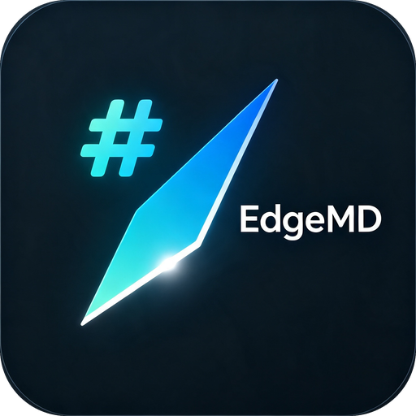
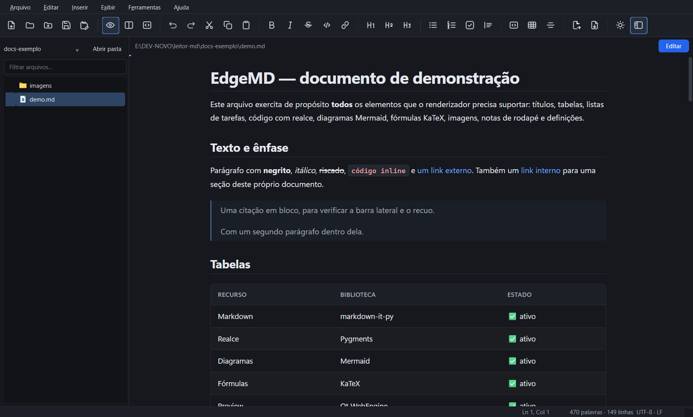
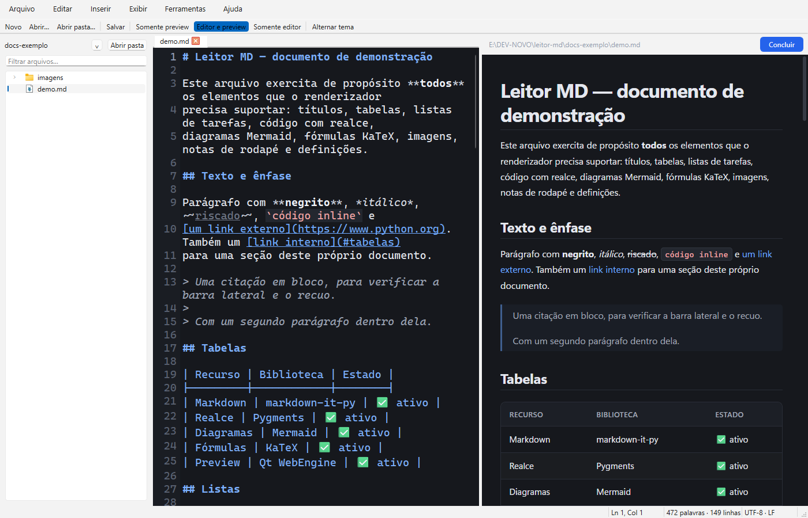
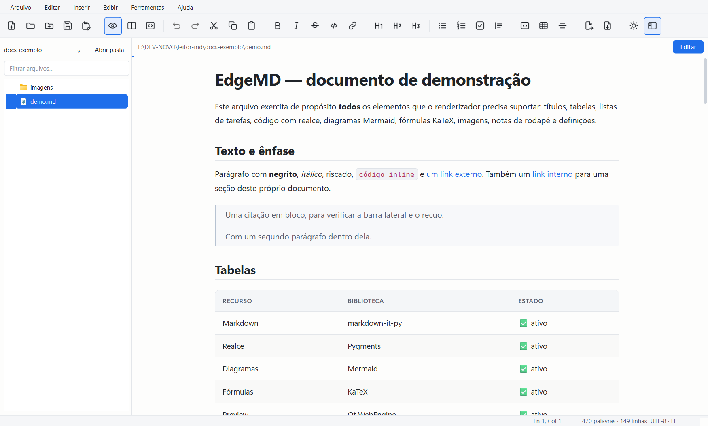

<div align="center">



# EdgeMD

**Leia Markdown como página, edite quando precisar.**

Leitor e editor de Markdown para Windows, com renderização por Chromium,
diagramas e fórmulas que funcionam offline, tema unificado em todo o
aplicativo e integração nativa com o Windows.

[](https://github.com/EduradoPessoa/edge-md/actions/workflows/tests.yml)
[](https://www.python.org/)
[](#instala%C3%A7%C3%A3o)
[](LICENSE)

</div>

---

## Por que mais um leitor de Markdown

Porque a maioria obriga você a escolher entre duas coisas ruins: um
visualizador que não edita, ou um editor que abre com a tela cheia de código
quando você só queria ler.

O EdgeMD abre **lendo**. O documento ocupa a janela inteira, sem barra de
formatação nem painel de código. Quando você precisa mexer no texto, clica em
**Editar** — o botão azul no canto do documento — e a tela se divide: código à
esquerda, resultado à direita, atualizado enquanto você digita. **Concluir**
volta à leitura.

Também é um app do Windows de verdade, e não uma página num navegador:
instância única, ícone na bandeja e associação de arquivos.

## Recursos

<table>
<tr><td width="50%" valign="top">

**Leitura**

- Renderização por Chromium (Qt WebEngine)
- Tabelas, citações, notas de rodapé
- Listas de tarefas e de definição
- Realce de sintaxe com Pygments
- Botão de copiar em cada bloco de código
- Barra de progresso de leitura

</td><td width="50%" valign="top">

**Funciona sem internet**

- Diagramas [Mermaid](https://mermaid.js.org/) — fluxograma, sequência, classes
- Fórmulas [KaTeX](https://katex.org/) — em linha e em bloco
- Bibliotecas vendorizadas no repositório, não vindas de CDN

</td></tr>
<tr><td valign="top">

**Edição sob demanda**

- Abas, com marca de alteração não salva
- Numeração de linhas e realce de sintaxe
- `Enter` continua listas e citações
- Gravação atômica: nunca deixa arquivo pela metade
- Preserva encoding (UTF-8/UTF-16/Windows-1252) e fim de linha

</td><td valign="top">

**Sistema e integração**

- Tema claro e escuro em **todo** o aplicativo
- Instância única: dez cliques duplos, uma janela
- Bandeja do Windows, com aviso de alterações pendentes
- Associação de `.md` gravada em `HKCU` — sem administrador
- Exportação para HTML autônomo e PDF

</td></tr>
</table>

## Capturas

<div align="center">

**Modo de leitura** — o padrão ao abrir



**Modo de edição** — um clique em *Editar*



**Tema claro**



</div>

## Instalação

Requer **Python 3.10 ou superior** e Windows 10 ou 11.

```powershell
git clone https://github.com/EduradoPessoa/edge-md.git
cd edge-md

python -m pip install -r requirements.txt

# Bibliotecas de diagrama e fórmula (~4,7 MB, uma vez)
python tools\fetch_vendor.py

# Ícones a partir da arte de origem
python tools\make_icons.py

pythonw run.pyw
```

Sem `pythonw`, use `python -m edgemd` — a diferença é que aparece uma janela de
console junto.

> **Atenção ao Qt WebEngine.** A versão do `PyQt6-WebEngine` precisa acompanhar
> a linha do `PyQt6`. O `requirements.txt` já fixa `PyQt6-WebEngine==6.10.0`
> para casar com o Qt 6.10; misturar 6.10 com 6.11 faz o Chromium não subir,
> com erro de contexto OpenGL.

## Uso

### Abrir arquivos

| Como | O quê |
|---|---|
| `Ctrl+O` | Abrir um ou vários arquivos |
| `Ctrl+Shift+O` | Abrir uma pasta na barra lateral |
| Arrastar e soltar | Solte arquivos para abrir, ou uma pasta para navegar |
| Clique duplo no `.md` | Só depois de associar (abaixo) |

### Associar arquivos `.md` ao EdgeMD

Pelo próprio programa: **Ferramentas → Associar arquivos .md a este app**.

Ou por linha de comando:

```powershell
# Adiciona a "Abrir com", sem mexer no seu programa padrão atual
.\installer\register_file_association.ps1

# Torna o EdgeMD o padrão do clique duplo
.\installer\register_file_association.ps1 -Default

# Desfaz tudo
.\installer\unregister_file_association.ps1
```

Nada disso exige administrador: tudo vai para `HKEY_CURRENT_USER`. O
desinstalador é conservador — se você tiver trocado o programa padrão depois, a
sua escolha é preservada.

### Atalhos

| Atalho | Ação | Atalho | Ação |
|---|---|---|---|
| `Ctrl+N` | Novo arquivo | `Ctrl+B` | Negrito |
| `Ctrl+O` | Abrir | `Ctrl+I` | Itálico |
| `Ctrl+S` | Salvar | `Ctrl+K` | Link |
| `Ctrl+W` | Fechar aba | `Ctrl+1` `Ctrl+2` `Ctrl+3` | Títulos 1 a 3 |
| `Ctrl+Shift+P` | Somente leitura | `Ctrl+Shift+C` | Bloco de código |
| `Ctrl+Shift+D` | Editar (lado a lado) | `Ctrl+Shift+T` | Tabela |
| `Ctrl+Shift+M` | Somente editor | `Ctrl+Shift+9` | Item de tarefa |
| `Ctrl+T` | Alternar tema | `Ctrl+E` | Exportar HTML |
| `Ctrl+L` | Barra lateral | `Ctrl+Shift+E` | Exportar PDF |
| Duplo clique no documento | Entrar na edição | `F5` | Redesenhar o preview |

Fechar a janela (**X**) não encerra o app: ele continua na bandeja. Para sair de
verdade, use **Arquivo → Sair** ou o menu do ícone na bandeja.

## Exportação

**HTML** gera um arquivo que funciona em qualquer máquina: as imagens locais são
embutidas como `data:` URI e Mermaid/KaTeX passam a vir de CDN, já que os
arquivos locais não viajam junto. O resultado é autocontido.

**PDF** usa a impressão do Chromium, em A4. A geração espera os diagramas e as
fórmulas terminarem de desenhar — sem isso, sairiam em branco.

## Gerar o executável

```powershell
python -m pip install pyinstaller Pillow
pyinstaller edgemd.spec --noconfirm --clean
```

O resultado é `dist\edgemd\edgemd.exe`. Depois de gerar, rode a associação
apontando para ele:

```powershell
.\installer\register_file_association.ps1 -ExePath dist\edgemd\edgemd.exe -Default
```

O executável fica grande (centenas de MB) porque carrega o Chromium inteiro — é
o preço da renderização fiel.

## Como foi feito

```
run.pyw                     entrada sem console
src/edgemd/
  app.py                    inicialização, argumentos, instância única
  window.py                 janela principal: abas, menus, barra de ferramentas
  editor_tab.py             um documento: caminho, encoding, gravação atômica
  editor_widget.py          editor com numeração de linhas
  md_highlighter.py         realce de sintaxe Markdown
  preview.py                QWebEngineView e a ponte com o JavaScript
  mode_bar.py               faixa com o nome do arquivo e Editar/Concluir
  sidebar.py                árvore de arquivos
  tray.py                   ícone na bandeja
  theme.py                  paleta única: gera o CSS do preview e o QSS do Qt
  icon_shapes.py            desenho dos ícones das ações, em SVG
  icons.py                  arte do produto e ícones de ação
  config.py                 preferências (QSettings)
  single_instance.py        canal de instância única (named pipe)
  file_association.py       registro das associações
  export.py                 exportação para HTML e PDF
  safety.py                 rede de segurança contra falhas na interface
  render/
    plugins.py              parser markdown-it-py e extensões
    renderer.py             Markdown -> documento HTML
    assets/                 CSS dos temas, JS do preview, vendor/
installer/                  scripts de associação (PowerShell)
tools/                      utilitários de build
tests/                      suíte pytest
```

Três decisões que valem o registro:

**Uma paleta, duas saídas.** O preview é HTML dentro do Chromium e o resto é Qt
— dois motores de estilo que não se conhecem. Enquanto as cores viveram nos dois
lugares, elas divergiram: trocar o tema mudava o documento e deixava menus e
barras no visual nativo. Hoje `theme.py` é a fonte única, e o CSS do preview é
gerado dela.

**Um preview, não um por aba.** Cada `QWebEngineView` traz um compositor
próprio; um por aba faria a memória crescer rápido demais. Como só uma aba
aparece por vez, existe um preview, e trocar de aba troca o conteúdo dele.

**Rede de segurança na interface.** No PyQt6, uma exceção não tratada num slot
não vira mensagem de erro: interrompe a entrega de eventos e o app morre sem
avisar. Um tratador global transforma isso em aviso — o app continua aberto.

## Mexer no visual

| Quero mudar | Edite | Depois rode |
|---|---|---|
| Cores, contraste, medidas | `src/edgemd/theme.py` | `python tools\generate_theme_css.py` |
| Desenho de um ícone de ação | `src/edgemd/icon_shapes.py` | `python tools\preview_icons.py` |
| Ícone do produto | `EdgeMD.png` (raiz) | `python tools\make_icons.py` |

O `generate_theme_css.py` é obrigatório depois de mexer na paleta: o preview lê
as cores de um arquivo CSS, que precisa ser regravado. Um teste falha se o
arquivo em disco divergir da paleta.

O `make_icons.py` recorta o ícone da arte de origem, deixa os cantos
transparentes, remove a marca de geração e monta o `.ico` multi-resolução. Nos
tamanhos abaixo de 40 px ele usa uma variante **sem** o texto "EdgeMD", porque
nesse tamanho o texto vira mancha cinza — e é justamente o tamanho da bandeja.

## Testes

```powershell
python -m pytest tests/ -q
```

Cobrem o pipeline de renderização, detecção de encoding, gravação atômica, o
canal de instância única, o registro de associação, o tema e os ícones. Os
testes de registro usam chaves próprias e as removem no fim — nenhum toca nas
associações reais da máquina.

Há também uma verificação de ponta a ponta da interface, que abre o
`docs-exemplo/demo.md`, inspeciona o DOM que o Chromium produziu (diagramas
desenhados, fórmulas convertidas, imagens carregadas) e grava capturas:

```powershell
python tools\smoke_gui.py                            # headless
$env:SMOKE_REAL='1'; python tools\smoke_gui.py       # janela real, imagem fiel
$env:SMOKE_THEME='light'; python tools\smoke_gui.py  # outro tema
$env:SMOKE_WINDOW='1'; python tools\smoke_gui.py     # foto da janela inteira
```

Ela falha se qualquer erro de JavaScript for registrado — foi assim que um bug
que quebrava a sincronia de rolagem em silêncio foi encontrado.

## Requisitos

| Pacote | Papel |
|---|---|
| PyQt6 + PyQt6-WebEngine | Interface e renderização Chromium |
| markdown-it-py + mdit-py-plugins | Parser CommonMark e extensões |
| Pygments | Realce de sintaxe |
| Mermaid (vendorizado) | Diagramas |
| KaTeX (vendorizado) | Fórmulas matemáticas |
| Pillow | Só para gerar os ícones |

## Limitações

- **Arquivos acima de ~2 MB** desligam a atualização automática do preview: o
  Chromium engasga ao reconstruir o documento a cada tecla. Use `F5` para
  atualizar sob demanda, ou o modo somente editor.
- **Uma barra lateral por vez**: abrir uma pasta substitui a anterior.
- **Somente Windows** na associação de arquivos, na bandeja e no envio para a
  Lixeira. O resto do app é portável.
- **Não há busca/substituição** dentro do documento ainda.

## Licença

[MIT](LICENSE) — use, modifique e distribua como quiser.

A arte do ícone foi gerada com auxílio de IA.
