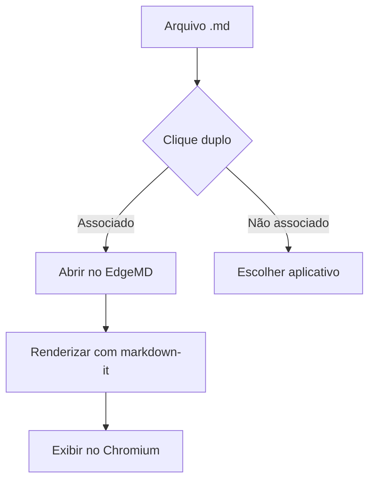
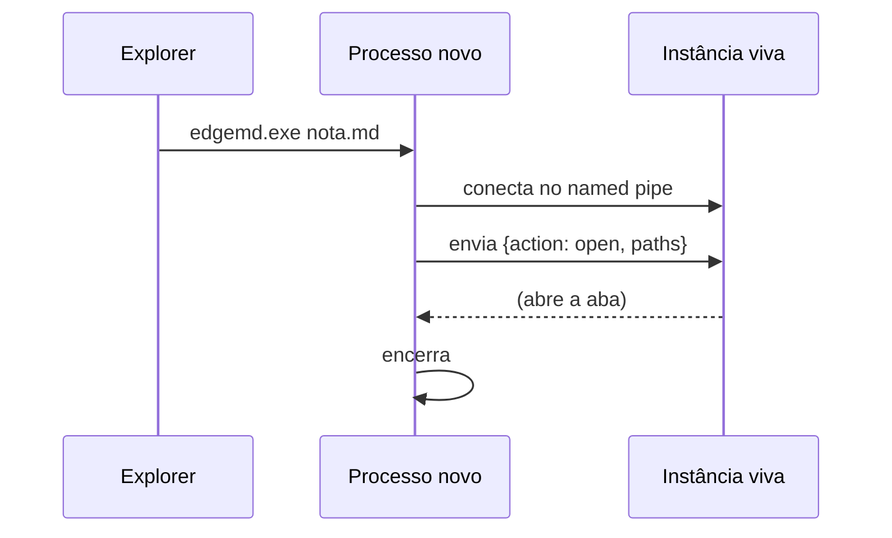
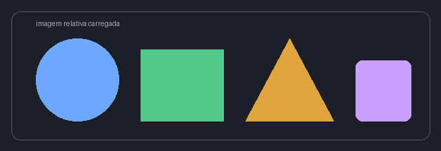

# EdgeMD — documento de demonstração

Este arquivo exercita de propósito **todos** os elementos que o renderizador
precisa suportar: títulos, tabelas, listas de tarefas, código com realce,
diagramas Mermaid, fórmulas KaTeX, imagens, notas de rodapé e definições.

## Texto e ênfase

Parágrafo com **negrito**, *itálico*, ~~riscado~~, `código inline` e
[um link externo](https://www.python.org). Também um [link interno](#tabelas)
para uma seção deste próprio documento.

> Uma citação em bloco, para verificar a barra lateral e o recuo.
>
> Com um segundo parágrafo dentro dela.

## Tabelas

| Recurso | Biblioteca | Estado |
|---------|------------|--------|
| Markdown | markdown-it-py | ✅ ativo |
| Realce | Pygments | ✅ ativo |
| Diagramas | Mermaid | ✅ ativo |
| Fórmulas | KaTeX | ✅ ativo |
| Preview | Qt WebEngine | ✅ ativo |

## Listas

1. Primeiro item numerado
2. Segundo item
   - subitem com marcador
   - outro subitem
3. Terceiro item

### Tarefas

- [x] Renderizar Markdown
- [x] Sincronizar rolagem
- [ ] Escrever a documentação

## Código com realce

```python
from pathlib import Path


def contar_palavras(caminho: Path) -> int:
    """Conta palavras de um arquivo Markdown."""
    texto = caminho.read_text(encoding="utf-8")
    return len([p for p in texto.split() if p.strip()])


if __name__ == "__main__":
    print(contar_palavras(Path("demo.md")))
```

```javascript
// Bloco em outra linguagem, para conferir o realce
const debounce = (fn, ms) => {
  let timer = null;
  return (...args) => {
    clearTimeout(timer);
    timer = setTimeout(() => fn(...args), ms);
  };
};
```

```sql
SELECT titulo, criado_em
  FROM notas
 WHERE arquivada = FALSE
 ORDER BY criado_em DESC
 LIMIT 10;
```

Um bloco sem linguagem declarada:

```
texto puro, sem realce
segunda linha
```

## Diagramas Mermaid





## Fórmulas KaTeX

Fórmula inline: a energia de repouso é $E = mc^2$, e a identidade de Euler é
$e^{i\pi} + 1 = 0$.

Fórmula em bloco:

$$
\int_{-\infty}^{\infty} e^{-x^2}\,dx = \sqrt{\pi}
$$

E uma um pouco mais elaborada:

$$
\frac{\partial}{\partial t}\Psi = \frac{i\hbar}{2m}\nabla^2\Psi
$$

Subscritos e sobrescritos: $x_i^2$, $a_{n+1}$, $\sum_{k=1}^{n} k = \frac{n(n+1)}{2}$.

## Imagem



## Definições

Markdown
: Formato de texto simples que virou padrão para documentação técnica.

Markdown-it
: Parser de Markdown compatível com a especificação CommonMark.

## Nota de rodapé

O Mermaid renderiza no próprio cliente[^1], e o KaTeX também[^2].

[^1]: Ou seja, o diagrama é desenhado sem precisar de servidor.
[^2]: As fontes do KaTeX são baixadas junto com o app, então funciona offline.

## Linha horizontal

---

Fim do documento de demonstração.
